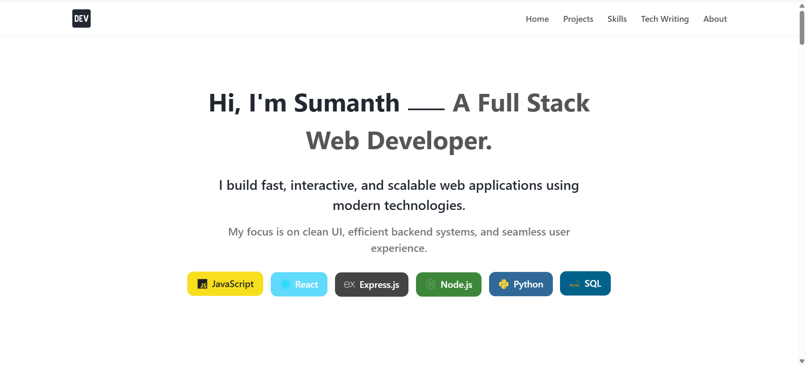

# **📁 Personal Portfolio — Built with React + Vite**


A modern, fast, and beautifully structured **personal developer portfolio** built using **React**, **Vite**, and clean component-based architecture.
It showcases my **projects, skills, tech case studies, and writing work** in a sleek, responsive interface.

---


## 🌐 **Live Demo**

Check out the deployed portfolio here:
👉 **[Personal Portfolio](https://sumanthsaivenkat-portffolio.netlify.app/)** 

---

## 🎥 **Preview**


---

## ✨ **Features**

* ⚡ **Fast & lightweight** — powered by Vite
* 🎨 **Modern UI** — clean layout, smooth animations
* 🧩 **Modular architecture** — scalable React structure
* 📱 **Fully responsive** — mobile-friendly design
* 🧠 **Case study & technical writing section**
* 🏗️ **Easily customizable** — well-organized components and styles
* 📌 **Showcases skills, projects, and personal branding**

---

## 📁 **Project Structure**

```
portfolio/
│
├── public/                           # Static assets, icons
│
├── src/
│    ├── assets/                      # Images, logos, thumbnails
│    │
│    ├── Components/
│    │    ├── About/                  # About section components
│    │    ├── case-study/             # UI for case studies
│    │    ├── Hero-section/           # Hero banner UI
│    │    ├── Navbar/                 # Navigation bar
│    │    ├── Projects/               # Projects listing UI
│    │    ├── Skills/                 # Skills section UI
│    │    └── Writing-Tech-Case-Studies/ # Blog/case study section
│    │
│    ├── pages/                       # Routing pages
│    │
│    ├── style/                       # Global + component styles
│    │    ├── App.css
│    │    ├── index.css
│    │
│    ├── App.jsx                      # Main application component
│    ├── main.jsx                     # Entry point
│
├── .hintrc                           # HTMLHint config
├── eslint.config.js                  # ESLint setup
├── index.html
├── package.json
├── package-lock.json
├── vite.config.js
└── README.md
```

---

## ⚙️ **Installation & Setup**

### 1️⃣ Clone the repository

```bash
git clone https://github.com/sumanthsaivenkat1113/portfolio.git
cd portfolio
```

### 2️⃣ Install dependencies

```bash
npm install
```

### 3️⃣ Start the development server

```bash
npm run dev
```

Then open:

```
http://localhost:5173
```

---

## 🛠️ **Tech Stack**

* **React.js**
* **Vite**
* **CSS Modules / Custom Styling**
* **Framer Motion**
* **React Icons**
* **Modular Component Design**

---

## 🌱 **Future Enhancements**

* Dark mode toggle
* CMS integration for writing/case studies
* SEO improvements
* Project carousel slider
* Theme customization panel
* Performance optimizations
* Add analytics for visitor tracking

---

## 🤝 **Contributing**

Want to improve the portfolio?
Feel free to fork the repo and submit a PR. Contributions are always welcome!

---

## 📄 **License**

MIT License — free to use, modify, and share.

---

## 👨‍💻 **Author**

**Sumanth Gunji**
Full-Stack Developer
Passionate about building clean, scalable AI-powered interfaces.

---


